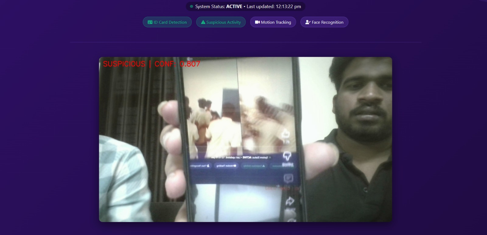
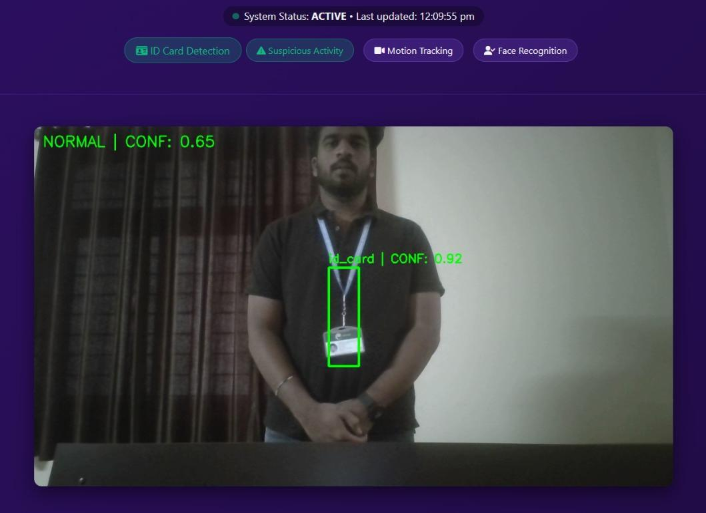

# 🎥 Suspicious Activity Detection in College Campus using Lightweight Deep Learning


## 🖼️ Project Preview
| Dashboard – Suspicious Detection | Dashboard – ID Card Detection |
|---|---|
|  |  |

## 🔍 About
A **real-time intelligent surveillance system** developed as a B.Tech final year project at **GITAM University, Bengaluru**. The system monitors campus CCTV footage and automatically identifies suspicious or illegal activities using a hybrid **CNN + LSTM** deep learning pipeline. Upon detection, it instantly sends **automated email alerts** to security personnel, enabling proactive intervention.

The system also includes a **YOLOv5-based ID card detection** module for identity verification — flagging unauthorized individuals without valid campus ID cards.

## 💡 Key Highlights
- 🧠 **CNN + LSTM hybrid model** — spatial feature extraction + temporal behavior analysis
- 🪪 **YOLOv5 ID Card Detection** — real-time identity verification on video feeds
- 🚨 **Automated Email Alerts** — instant notifications on suspicious activity detection
- 📊 **Confidence Averaging** — reduces false positives from momentary noise
- 🌐 **Flask Web Dashboard** — live video stream with real-time status & detection overlay
- 🎯 **Confidence Threshold: 0.807** — tuned for high precision in campus environments
- 🔁 **End-to-End Pipeline** — from live video capture to alert generation

## 🏗️ System Architecture

```
IP Camera
   │
   ▼
Frame Extraction & Preprocessing
   │
   ├──► CNN (Spatial Feature Extraction)
   │         │
   │         ▼
   │       LSTM (Temporal Behavior Analysis)
   │         │
   │    Confidence Score
   │         │
   │    Threshold Check ──► YES ──► 🚨 Alert Generation (Email)
   │         │ NO
   └──► YOLOv5 (ID Card Detection) ──► Email Alert if No ID
```

## 📊 Detection Modules

| Module | Model | Purpose |
|--------|-------|---------|
| 🧠 Activity Recognition | CNN + LSTM | Detects suspicious vs. normal behavior |
| 🪪 ID Card Detection | YOLOv5 | Verifies campus ID cards on individuals |
| 📧 Alert System | SMTP Email | Notifies security on suspicious detection |
| 🖥️ Dashboard | Flask + OpenCV | Live video feed with detection overlay |

## 🔔 Alert System Flow
```
Suspicious Activity Detected
   → Confidence Score Computed
   → Threshold Exceeded
   → Email Alert Sent: "Suspicious activity detected! Confidence: 0.807"
   → Security Personnel Notified ✅
```

## 🛠️ Tech Stack

- **Python** — core language
- **TensorFlow / Keras** — CNN–LSTM model training & inference
- **YOLOv5** — real-time ID card object detection
- **OpenCV** — live video capture and frame processing
- **Flask** — web-based monitoring dashboard
- **SQLite** — user and log management
- **SMTP** — automated email alert delivery

## 📁 Project Structure

| File | Description |
|------|-------------|
| `app.py` | Flask web application & dashboard |
| `sus train.py` | CNN–LSTM model training script |
| `sus test.py` | Suspicious activity inference script |
| `final test.py` | Final evaluation & testing script |
| `test.py` | General utility testing |
| `mobilenet_lstm_generator.h5` | Trained Keras model (MobileNetV2 + LSTM) |
| `best.pt` | Best YOLOv5 checkpoint for ID card detection |
| `classes.txt` | Defined activity classes |
| `users.db` | SQLite user/security personnel database |

## 🚀 How to Run

```bash
git clone https://github.com/saibharath0618/Suspicious-Activity-Detection-in-Surveillance-Videos-Using-Deep-Learning.git
cd Suspicious-Activity-Detection-in-Surveillance-Videos-Using-Deep-Learning
pip install -r requirements.txt
python app.py
```

**Retrain the model:**
```bash
python "sus train.py"
```

**Evaluate performance:**
```bash
python "final test.py"
```

## 🧪 Performance

| Metric | Value |
|--------|-------|
| Activity Detection Confidence | Up to **0.807** |
| ID Card Detection Confidence | Up to **0.92** |
| Inference Mode | Real-time |
| Alert Latency | Seconds after detection |

## 📅 Project Info

- **Institution:** GITAM School of CSE, GITAM (Deemed to be University), Bengaluru
- **Degree:** B.Tech in Computer Science & Systems Engineering
- **Year:** 2026
- **Guide:** Dr. Divya Pushpa Lakshmi M, Assistant Professor
- **Team:** D. Nikil Reddy · P. Sai Bharath · S. Sruthi · P. Sree Pavan

## 🙋 About Me

**Patakanoor Sai Bharath** — Aspiring Data & AI Engineer  
Passionate about building intelligent systems that solve real-world problems.

[](https://www.linkedin.com/in/patakanoor-sai-bharath-02643125b)
[](https://github.com/saibharath0618)
